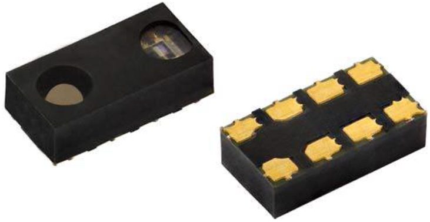

# VCNL4040 Arduino Library

VCNL4040 is a fully integrated proximity and ambient light sensor with infrared emitter, I2C interface, and interrupt function. See <a href="Documents/VCNL4040 Proximity Sensor Datasheet.pdf">datasheet</a> for detailed information.



Library feature list:

 * Easy VCNL4040 interfacing
 * Proximity measurement
 * Ambient light as Raw value, Lux and White value
 * Proximity/Ambient light threshold interrupts (not implemented yet!) 

## History
2017-06-07 Initial release

## Installation
Download the ZIP file and extract its content. Move the TTVCNL4040 folder to "ARDUINOAPP/hardware/libraries/". In the Arduino IDE you'll find the sample sketches under Samples->TTVCNL4040.

## Wiring


If you are using an Arduino board other than 3.3V, ensure to use a logic level shifter!


white: SDA (3.3V!)<br>
grey: SCL (3.3V!)<br>
purple: INT (optional)

## Usage
### Create object TTVCNL4040()
Don't forget to enable ambient light or proximity sensing after creating the object.

#### Parameters
none

#### Example
```cpp
TTVCNL4040 vcnl4040 = TTVCNL4040();
```

### isConnected()
Returns true if IC is connected correctly and detected by the I2C master.

#### Parameters
none

#### Returns
boolean true/false

#### Example
```cpp
if(vcnl4040.isConnected()){
  Serial.println("VCNL4040 IC is connected and running.");
}
```


### enableALS()
Enables the ambient light sensing.

#### Parameters
none

#### Returns
nothing

#### Example
```cpp
vcnl4040.enableALS();
Serial.println(vcnl4040.readALS());
```


### setALSIntegrationTime(time)
Sets the timing and the corresponding multiplier for lux conversion.

#### Parameters
time: ALS_IT_80MS -> 7864 lux max., ALS_IT_160MS -> 3832 lux max., ALS_IT_320MS -> 1966 lux max., ALS_IT_640MS -> 983 lux max.

#### Returns
nothing

#### Example
```cpp
vcnl4040.setALSIntegrationTime(ALS_IT_160MS);
```


### isALSEnabled()
Returns true if ambient light sensing is active.

#### Parameters
none

#### Returns
boolean true/false

#### Example
```cpp
if(vcnl4040.isALSEnabled()){
  //do something
}
```


### readALS()
Returns the ambient light sensing value as an unsigned integer.

#### Parameters
none

#### Returns
unsigned int: Current ambient light value.

#### Example
```cpp
Serial.println(vcnl4040.readALS());
```


### readWhite()
Returns the white channel value as an unsigned integer.

#### Parameters
none

#### Returns
unsigned int: Current white light value.

#### Example
```cpp
Serial.println(vcnl4040.readWhite());
```


### readLux()
Returns the lux value as an unsigned integer. Sensitivity can be set by calling the setALSIntegrationTime() method.

#### Parameters
none

#### Returns
unsigned int: Current lux value.

#### Example
```cpp
Serial.println(vcnl4040.readLux());
```


### disableALS()
Disables the ambient light sensing. No ALS data can be read anymore.

#### Parameters
none

#### Returns
nothing

#### Example
```cpp
vcnl4040.disableALS();
```


### enablePS(irPower)
Enables the proximity sensing functionality.

#### Parameters
irPower: IR_PWR_50MA, IR_PWR_75MA, IR_PWR_100MA, IR_PWR_120MA, IR_PWR_140MA, IR_PWR_160MA, IR_PWR_180MA or IR_PWR_200MA

#### Returns
nothing

#### Example
```cpp
vcnl4040.enablePS(IR_PWR_200MA);
```


### isPSEnabled()
Returns true if proximity sensing is active.

#### Parameters
none

#### Returns
boolean true/false

#### Example
```cpp
if(vcnl4040.isPSEnabled()){
  //do something
}
```


### disablePS()
Disables the proximity sensing functionality. No PS data can be read anymore.

#### Parameters
none

#### Returns
nothing

#### Example
```cpp
vcnl4040.disablePS();
```


### readCommandRegister(registerAddress)
Returns the selected register's two bytes as an unsigned integer.

#### Parameters
registerAddress: 0x00 - 0x0C (see datasheet page 9)

#### Returns
unsigned int: containing the two register bytes (high and low byte)

#### Example
```cpp
unsigned int value = vcnl4040.readCommandRegister(0x0C);
```


### writeCommandRegister(registerAddress, lowByte, highByte)
Writes to the selected register.

#### Parameters
registerAddress: 0x00 - 0x0C (see datasheet page 9)<br>
lowByte: The low byte of a 16bit integer value
highByte: The high byte of a 16bit integer value

#### Returns
nothing

#### Example
```cpp
vcnl4040.writeCommandRegister(0x00, 0x00, 0x00);
```
